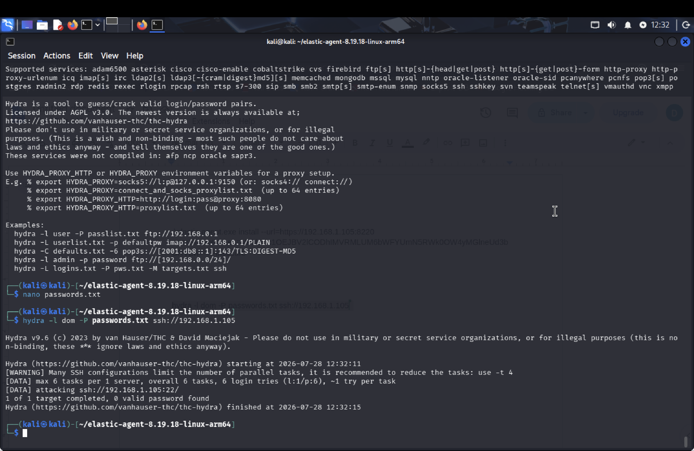
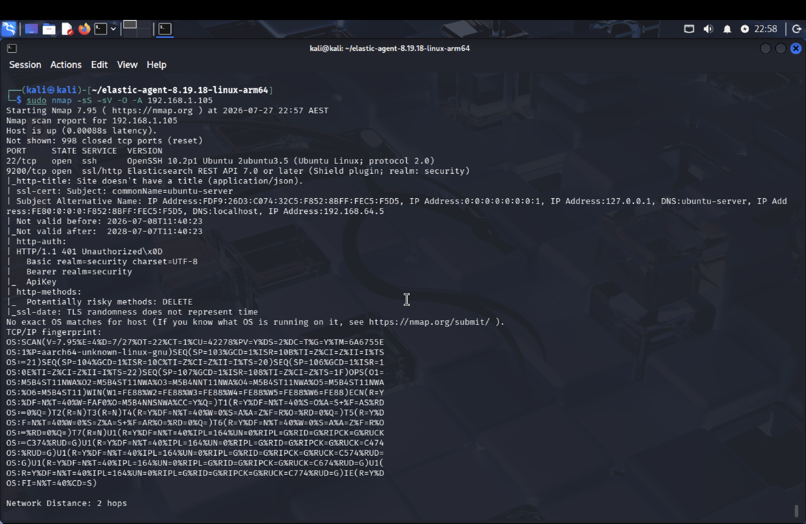

# Attack Simulations

## Overview

To validate the monitoring and detection capabilities of the Home SOC lab, controlled attacks were generated from the Kali Linux VM against the Ubuntu Server.

The purpose of these simulations was to generate realistic security telemetry, confirm that the activity was collected by the Elastic Stack, and investigate whether the attacks could be detected through Elastic Security and Suricata.

Two primary attack scenarios were performed:

1. SSH brute-force attack using Hydra
2. Network reconnaissance using Nmap

> All attack simulations were performed within my own isolated Home SOC lab environment.

---

# 1. SSH Brute-Force Simulation

## Objective

The objective of this simulation was to generate repeated failed SSH authentication attempts against the Ubuntu Server and determine whether the activity could be identified within Elastic.

Kali Linux was used as the attacking system, while the Ubuntu Server acted as the SSH target.

## Attack Tool

**Hydra** was used to automate SSH authentication attempts using a controlled password list created specifically for the lab.

The attack followed the general structure:

```bash
hydra -l <username> -P <password-list> ssh://<target-ip>
```

The target address and credentials are omitted from the documentation because they are specific to the local lab environment.




## Attack Flow

The attack followed this path:

**Kali Linux → Hydra → Ubuntu SSH Service → Authentication Logs → Elastic Agent → Elasticsearch → Elastic Security**

The corresponding workflow is shown in:

`../diagrams/attack-workflow.png`

## Generated Telemetry

The Hydra activity generated multiple failed SSH authentication events on the Ubuntu Server.

The authentication activity was visible in Kibana Discover using the `system.auth` dataset.

A useful KQL filter for investigating the events was:

```text
event.dataset:"system.auth" and event.outcome:"failure"
```

This allowed failed authentication events to be separated from normal system activity.

## Detection

A custom Elastic Security detection rule was used to identify repeated SSH authentication failures.

The rule generated an:

**SSH Brute Force Attempt**

alert after the simulated attack generated sufficient failed authentication activity.

This demonstrated the complete detection pipeline:

**Attack → Log Generation → Collection → Detection → Alert**

## Result

The simulation successfully demonstrated that SSH brute-force activity generated from Kali Linux could be observed and investigated within the Elastic Stack.

The test validated:

* SSH authentication log collection
* Elastic Agent ingestion
* KQL-based investigation
* Custom detection logic
* Security alert generation

---

# 2. Nmap Network Reconnaissance

## Objective

The second simulation tested whether network reconnaissance activity could be identified by the network intrusion detection component of the lab.

Nmap was used from Kali Linux to scan the Ubuntu Server.

## Attack Tool

**Nmap** was used to perform network reconnaissance against the target.

A SYN scan was performed using:

```bash
sudo nmap -sS <target-ip>
```

Additional Nmap scanning was also used during the lab to identify exposed services.

## Detection Flow

The network detection path was:

**Kali Linux → Nmap Scan → Ubuntu Network Interface → Suricata IDS → Elastic Agent → Elasticsearch → Kibana**

Suricata monitored the network traffic and generated IDS telemetry when suspicious scanning behaviour was observed.


## Suricata Detection

The scan generated the custom Suricata alert:

```text
HOME LAB - Possible Nmap SYN Scan
```

The resulting event was ingested into Elasticsearch and became searchable within Kibana Discover.

Alert events could also be investigated using:

```text
event.kind:"alert"
```

This provided a way to isolate IDS alerts from other collected telemetry.

## Result

The Nmap simulation successfully demonstrated network-based detection within the Home SOC environment.

The test validated:

* Network traffic monitoring
* Suricata IDS operation
* Nmap reconnaissance detection
* Elastic Agent log forwarding
* Elasticsearch indexing
* Kibana investigation

---


# Detection Pipeline Summary

The two simulations demonstrated two different sources of security telemetry.

### Host-Based Detection

```text
Hydra
  ↓
SSH Authentication
  ↓
system.auth
  ↓
Elastic Agent
  ↓
Elasticsearch
  ↓
Elastic Detection Rule
  ↓
Security Alert
```

### Network-Based Detection

```text
Nmap
  ↓
Network Traffic
  ↓
Suricata IDS
  ↓
IDS Alert
  ↓
Elastic Agent
  ↓
Elasticsearch
  ↓
Kibana
```

Together, these simulations demonstrate how both host authentication telemetry and network IDS telemetry can be centralised and investigated within the same SOC environment.

---

# Ethical Scope

All scanning and authentication testing documented in this project was conducted exclusively against systems within my own controlled virtual lab environment.

The simulations were performed for cybersecurity education, detection validation, and defensive security testing.

